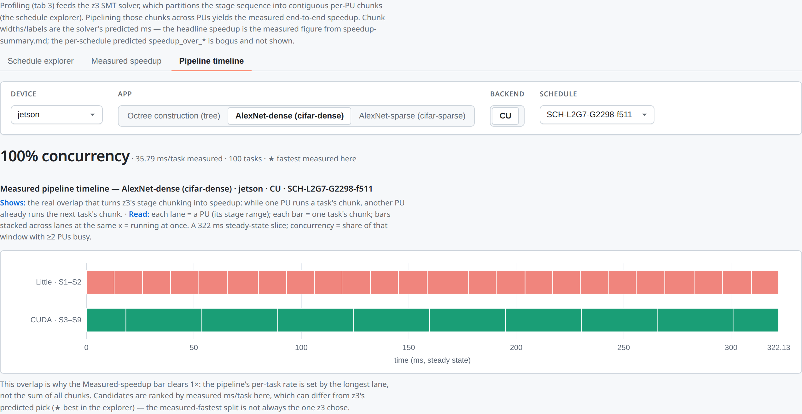
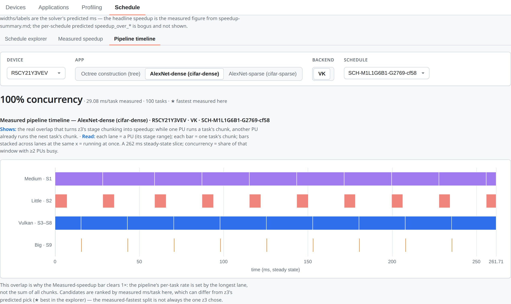
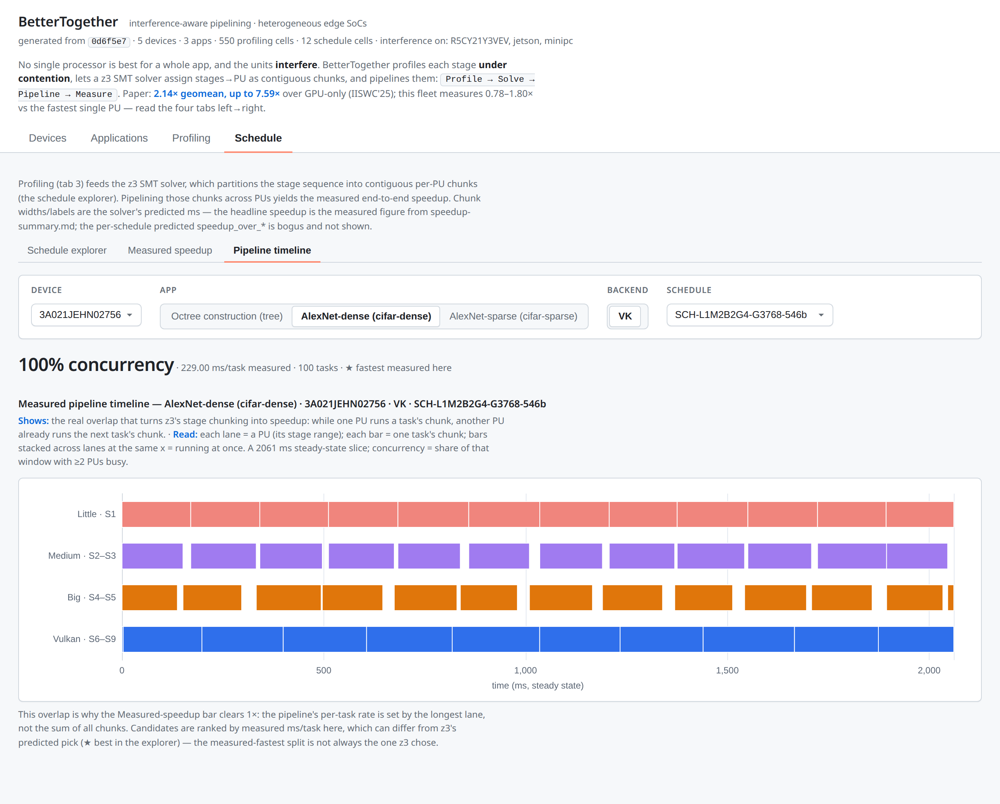

<div align="center">


# BetterTogether

**Profile-guided software pipelining for _integrated_ heterogeneous edge SoCs** — pipeline an
app's stages across the CPU cores **and the integrated GPU/accelerator** that share the chip.

<p>
  
  
  
  
  
  
  <a href="LICENSE"></a>
</p>

</div>

> **TL;DR** — BetterTogether is a framework for **integrated** SoCs, where the CPU cores and the
> **integrated GPU/accelerator share one pool of memory and bandwidth**. That sharing is the whole
> point: data passes between processing units zero-copy (no PCIe transfer), but running them
> together makes them *interfere*, so naive offloading mispredicts latency. BetterTogether
> profiles each application stage **under representative interference**, solves stage→PU
> assignment with a **z3 SMT** solver, and runs the stages as a real software pipeline across the
> chip.

---

## Overview

Modern edge SoCs (phones, Jetson, mini-PCs) are **integrated**: big/medium/little CPU cores and
the GPU (or other accelerators) sit on one die and **share the same memory and memory bandwidth**.
This changes the offloading problem in two ways that discrete-GPU frameworks don't have to model:

- **No transfer cost** — buffers are unified (UMA), so handing data from a CPU stage to a GPU
  stage is zero-copy. Fine-grained stage-by-stage pipelining becomes practical.
- **Interference** — because the units share memory and bandwidth, running them at the same time
  makes each *slower* than it looks in isolation. Per-unit performance is not composable, so a
  schedule built from isolated measurements mispredicts real latency.

BetterTogether is a framework that turns this into throughput. You provide an application as a
sequence of **stages**, each with a kernel in up to three backends — **OMP** (CPU), **CUDA**
(NVIDIA integrated GPU), **Vulkan** (cross-vendor integrated GPU). The framework profiles every
stage on every processing unit **under representative interference**, hands that model to a **z3
SMT** solver to assign each stage to a unit, and executes the result as a real software pipeline.
Its integrated-GPU focus is baked in: the Vulkan engine deliberately selects the *integrated* GPU
(a discrete card is rejected with "No integrated GPU found").

This repository is the **actively-developed framework** — it has grown over years well beyond the
research that first described it (see [Citation](#citation)). It is not a frozen paper artifact.

---

## Highlights

- 🎯 **Built for integrated accelerators** — assumes a shared-memory SoC: zero-copy UMA buffers
  between stages, and a model of the cross-unit *interference* that only integrated chips have.
- 🧪 **Interference-aware performance modeling** — profiles stages under representative
  intra-application background load, predicting real pipeline latency far better than isolated
  profiling.
- 🧠 **SMT-based scheduling** — a z3 solver maps each application stage to the most efficient
  processing unit (big/medium/little CPU cores or the integrated GPU) and emits a static schedule.
- ⚡ **Fine-grained software pipelining** — stages stream across PUs concurrently, overlapping
  CPU and integrated-GPU work the way a single-unit baseline cannot.
- 📱 **Cross-vendor integrated GPUs** — runs on Arm Mali and Qualcomm Adreno phones, NVIDIA
  Jetson, and AMD/Intel iGPU mini-PCs; "add a device = drop in a JSON file".
- 🔧 **Multi-backend & extensible** — OpenMP (CPU), CUDA, and Vulkan compute today; designed to
  extend to other integrated accelerators.

---

## Motivation — why one unit is not enough

Within a single application, different stages favor different processing units, and the best
mapping shifts from device to device. In a 3D octree pipeline, for instance, the sorting stage
tends to run fastest on the big/medium CPU cores, building the radix tree favors the GPU, and
octree construction is roughly a tie — so running *everything* on the GPU (or everything on the
CPU) leaves throughput on the table.

On an **integrated** SoC there is a second twist: the units share memory and bandwidth, so their
times measured *in isolation* don't add up once they run concurrently — they interfere. A
schedule built from isolated profiling therefore mispredicts. BetterTogether profiles stages
under realistic interference, assigns each to its best unit, and overlaps them in a pipeline —
turning heterogeneity into throughput instead of a scheduling headache.

---

## How it works — three tools talking through files

An application is a sequence of **stages**; each stage has a kernel in up to three backends
(**OMP** CPU, **CUDA**, **Vulkan**). The framework is three tools passing files:

```
  BT-Profiler  ──▶  JSONL profiling store  ──▶  BT-Optimizer (Python / z3 SMT)
   (C++)            data/profiling/…                      │
   measures each                                   schedule JSON
   stage×PU under                                         ▼
   interference                          BT-Implementer (C++ runtime:
                                         SPSC-queue dispatchers + UMA buffers)
```

1. **BT-Profiler** runs each `(stage × PU)` cell on the device, in isolation *and* under
   interference, emitting a schema-validated JSONL profiling table.
2. **BT-Optimizer** (Python/z3) reads that table and solves stage→PU assignment, emitting an
   array of candidate schedules (the cross-tool contract).
3. **BT-Implementer** (the C++ runtime) executes a schedule as a real software pipeline, handing
   data between stages through **zero-copy UMA buffers** — cheap precisely because the GPU is
   integrated and shares the CPU's memory.

The primary extension axis is **devices**: *add a device = drop in a `devices/<id>.json` data
file.*

The solver decides how many stages run where. A schedule can be a simple **CPU + GPU overlap**,
or a fully **heterogeneous split** across multiple CPU tiers and the integrated GPU — whatever the
interference-aware model predicts is fastest for that app on that chip:

<div align="center">
<table>
<tr>
<td width="50%"></td>
<td width="50%"></td>
</tr>
<tr>
<td align="center"><sub>2-lane CPU(S1–2) + GPU(S3–9) overlap — Jetson · cifar-dense · CUDA</sub></td>
<td align="center"><sub>4-way split (Medium / Little / Vulkan / Big) — Samsung · cifar-dense · Vulkan</sub></td>
</tr>
</table>
</div>

---

## Applications

The framework ships four reference applications. Each is a sequence of stages with per-backend
kernels and an OMP-as-oracle differential test:

| Application | Description | Stages | Backends | Compare mode |
|------------|-------------|--------|----------|--------------|
| **cifar-dense** | Dense AlexNet CNN inference on CIFAR-10 | 9 today → 11 canonical | OMP · CUDA · Vulkan | float (`NearEqual`) |
| **cifar-sparse** | Pruned/sparse AlexNet (irregular memory access) | 9 today → 11 canonical | OMP · CUDA · Vulkan | float (`NearEqual`) |
| **tree** | 3D octree construction (morton → sort → unique → radix-tree → edge-count → prefix-sum → octree-build) | 7 | OMP · CUDA · Vulkan | exact (integer/structural) |
| **octree** | octree-construction variant | 7 | OMP · Vulkan | exact |

These workloads suit pipeline parallelism: they decompose into distinct stages, process
streaming inputs (e.g. image frames), and exhibit per-stage PU heterogeneity. Bring your own app
by implementing its stages against the same backend interfaces.

> Stage counts reflect the **currently implemented** kernels (`vocab.json` is the single source
> of truth). The canonical `AlexNetCIFAR` spec
> ([`docs/instruction-for-ai/04-alexnet-cifar-spec.md`](docs/instruction-for-ai/04-alexnet-cifar-spec.md))
> is 11 stages; the C++ kernels still implement the 9-stage `SmallAlexNet` and are not yet
> migrated to it.

---

## Getting Started

### Requirements

| | Tool | Notes |
|---|---|---|
| **Required** | [CMake](https://cmake.org/) ≥ 3.25 | presets-based; C/C++ deps auto-fetched via CPM |
| | C++20 compiler | gcc 11+ / clang 14+ |
| | [uv](https://astral.sh/uv) | Python package manager (Python 3.13+) |
| | [just](https://github.com/casey/just) | command runner for the build/test matrix |
| **Optional** | CUDA Toolkit · Vulkan SDK · Android NDK + ADB | for the CUDA / Vulkan / Android targets |

```bash
curl -LsSf https://astral.sh/uv/install.sh | sh   # uv (Python)
cargo install just                                # just (command runner)
# CMake ≥ 3.25 via your package manager (apt/brew/pip)
```

### Build & test

```bash
# x86_64 PC — CPU/OpenMP, the everyday build & test gate
cmake --preset pc && cmake --build --preset pc
ctest --test-dir build/pc -L omp --output-on-failure
```

Other targets (Vulkan on an integrated-GPU box, NVIDIA Jetson via the cross container, Android
arm64):

```bash
cmake --preset vulkan  && cmake --build --preset vulkan    # iGPU box (e.g. AMD Radeon, Intel)
cmake --preset jetson  && cmake --build --preset jetson    # via bt-cross:6.1 container
cmake --preset android && cmake --build --preset android   # needs ANDROID_NDK_HOME
```

Convenience wrappers (`just build-x86` / `build-jetson` / `build-android`, then `just test`)
build and run the unit-test matrix across the fleet. Testing is **OMP-as-oracle differential**:
each backend's stages are compared against the in-process OpenMP reference. Full
preset/cross-build/deploy details: [`docs/instruction-for-ai/02-building.md`](docs/instruction-for-ai/02-building.md).

### Run the full pipeline (profile → schedule → run → compare)

The end-to-end procedure with every gotcha is in
[`docs/instruction-for-ai/06-end-to-end-scheduling.md`](docs/instruction-for-ai/06-end-to-end-scheduling.md);
the short version:

```bash
# 1. Profile: run the per-(app×backend) bm-prof binary on the device, capture stdout (pure JSONL)
ssh <host> 'cd /tmp/bt && LD_LIBRARY_PATH=. BT_PROF_SCENARIO=interference \
  ./bm-prof-cifar-sparse-vk --device 3A021JEHN02756 2>/dev/null' \
  > data/profiling/3A021JEHN02756/cifar-sparse/vulkan/interference/run-001.jsonl

# 2. Generate schedules: z3 reads the JSONL store directly (no CSV step) and emits candidates
uv run optimizer/orchestrate/02_gen_schedule_merged.py --profiling_root data/profiling \
  --device 3A021JEHN02756 --app cifar-sparse --backend vk --table_type btpm \
  --minimize_mode tmax --num_solutions 10 --output_folder data/schedules_btpm

# 3. Run the schedule(s) on the device and capture per-task timing logs
uv run optimizer/orchestrate/03_run_schedule.py --device 3A021JEHN02756 --app cifar-sparse \
  --backend vk --table-type btpm --minimize-mode tmax --ssh-host <host> --build-dir build/vulkan \
  --log-folder data/sched_logs/3A021JEHN02756_cifar-sparse_vk

# 4. Parse / measure makespan vs the single-PU baseline → speedup
uv run optimizer/orchestrate/04_parse_schedules.py data/sched_logs/3A021JEHN02756_cifar-sparse_vk
```

Everything under `data/` (the JSONL profiling store, generated schedules, run logs, the CIFAR
dataset, trained weights) is **regenerable and git-ignored** — it is pipeline *output*, not
source.

#### Optimization modes

The optimizer takes a profiling table (`btpm` = interference-aware, `isolated` = standalone) and
an objective (`gapness` = minimize scheduling gaps, `tmax` = minimize the max chunk time):

| Mode | Description |
|------|-------------|
| `btpm + tmax` | interference-aware model, minimize max chunk time |
| `btpm + gapness` | interference-aware model, minimize scheduling gaps |
| `isolated + tmax` | isolated model, minimize max chunk time |
| `isolated + gapness` | isolated model, minimize gaps |

> Use the **isolated** table when scheduling a single app running alone; the BTPM table inflates
> shared-memory iGPU time and over-splits onto the CPU (see the end-to-end doc's gotchas).

---

## Repository Structure

The tree is **component-first** (the old `builtin-apps/`, `pipe/`, `utility/` were dissolved into
these components by the 2026-06 refactor):

```
better-together/
├── apps/                  # Per-application kernels: omp/ cuda/ vulkan/ + differential oracle
│   ├── cifar-dense/       #   each app provides the same stages in up to 3 backends,
│   ├── cifar-sparse/      #   plus appdata + a *_diff_oracle.hpp for OMP-as-oracle tests
│   ├── tree/
│   └── octree/            #   (OMP + Vulkan only)
├── platform/              # Backend-agnostic substrate
│   ├── engine/            #   cuda/ + vulkan/ compute engines (kiss-vk, UMA buffers)
│   ├── mem/               #   memory-resource helpers
│   ├── registry/          #   device registry (generated/ from devices/*.json)
│   ├── vocab/             #   generated/ vocabulary header (from vocab.json)
│   └── util/              #   ndarray, npy loader, resource paths, debug logging
├── runtime/               # BT-Implementer: app-agnostic pipeline engine
│   │                      #   (SPSC queues, schedule/config readers, task dispatch)
│   └── tests/
├── profiler/              # BT-Profiler: bm-prof / bm-baseline / bm-gen-logs drivers
│                          #   + per-(app×backend) sources (cifar-dense-vk/, tree-cu/, …)
├── optimizer/             # BT-Optimizer (Python package): z3 SMT scheduler
│   ├── smt/               #   solver, constraints, profiling loader, vocab
│   ├── orchestrate/       #   02_gen_schedule / 03_run_schedule / 04_parse / 05_timeline
│   └── analysis/          #   coverage + isolated-table rendering
├── tools/                 # Standalone probes (affinity, cpuinfo, Vulkan version, stress)
├── devices/               # Per-device topology specs (*.json, schema-validated, the SoT)
├── schemas/               # JSON Schemas: device-spec, profiling-table, schedule (contracts)
├── vocab.json             # Single source of truth for PU tiers / backends / stage counts
├── cmake/                 # Toolchains, CPM, per-backend target helpers
├── scripts/               # Build/deploy wrappers, codegen, device-spec validation, figures
├── resources/             # Model weights / CIFAR params (regenerable; see scripts/data_prep)
├── dashboard/             # Static offline analysis site (devices / apps / profiling / schedules)
├── docs/                  # instruction-for-ai/ (how-to) + reports-for-human/ (status)
└── data/                  # Profiling store + schedules + run logs (git-ignored, regenerable)
```

> **Working on the code (human or AI)?** Start with
> [`docs/instruction-for-ai/README.md`](docs/instruction-for-ai/README.md) — project goal,
> hardware & access, build, test, and the canonical model spec. Status, audits, and roadmaps are
> in [`docs/reports-for-human/`](docs/reports-for-human/).

---

## Data Formats & Contracts

<details>
<summary><b>Device specification</b> — <code>devices/&lt;id&gt;.json</code> (the framework's extension axis)</summary>

Adding a device = dropping in a schema-validated JSON
([`schemas/device-spec.schema.json`](schemas/device-spec.schema.json)) — the **source of
truth**. At build time `scripts/embed_device_specs.py` codegens these into the C++ device
registry (`platform/registry/generated/`); do **not** hand-edit `platform/registry/conf.cpp`.

```json
{
  "id": "3A021JEHN02756",
  "description": "Google Pixel 7a (Tensor G2): 4 little + 2 medium + 2 big.",
  "cores": [
    { "id": 0, "type": "little", "pinnable": true },
    { "id": 4, "type": "medium", "pinnable": true },
    { "id": 6, "type": "big",    "pinnable": true }
  ],
  "gpu": { "backend": "vulkan", "name": "Mali-G710", "subgroup_size": 16 }
}
```

Find a phone's device ID with `adb devices`; validate a new spec with
`uv run scripts/validate_devices.py` and rebuild to regenerate the registry.

</details>

<details>
<summary><b>Schedule</b> — the BT-Optimizer → BT-Implementer contract</summary>

A schedule file ([`schemas/schedule.schema.json`](schemas/schedule.schema.json)) is an **array
of candidate schedules**; each partitions the application's stages into contiguous chunks across
PUs. Stage numbering is **1-based and inclusive**, and chunks must contiguously cover
`[1, n_stages]`:

```json
[
  {
    "uid": "SCH-0001",
    "solution_id": 1,
    "chunks": [
      { "core_type": "GPU", "start_stage": 1, "end_stage": 3, "hardware": "gpu_vulkan" },
      { "core_type": "Big", "start_stage": 4, "end_stage": 7 }
    ],
    "metrics": { "max_time": 3.21 }
  }
]
```

`core_type` is one of `Little`/`Medium`/`Big`/`GPU`; a `GPU` chunk additionally requires
`hardware` (`gpu_cuda` or `gpu_vulkan`). `metrics` is advisory — the runtime ignores it.

</details>

---

## Analysis Dashboard

The repo ships a self-contained, **offline static dashboard** (`dashboard/`) that
cross-references the whole project: the device fleet, per-app stage breakdowns, the collected
profiling tables, and a schedule explorer (z3 chunk assignments with measured speedup-over-
baseline). It builds to a single bundle and can be served locally (e.g. over Tailscale) with no
backend. See [`docs/reports-for-human/`](docs/reports-for-human/) for how to generate and serve
it.

<div align="center">

<br/>
<sub>The dashboard walks Profile → Solve → Pipeline → Measure, landing on a 4-lane pipeline running at 100% concurrency.</sub>
</div>

To visualize a single generated schedule or run, the `optimizer/` and `scripts/` tools also
work standalone:

```bash
uv run scripts/view/view_schedule.py data/schedules_btpm/<device>/<app>/<backend>/schedules_btpm_tmax.json
uv run optimizer/orchestrate/05_timeline.py data/sched_logs/<device>_<app>_<backend>
```

---

## Citation

The research behind BetterTogether appeared at **IISWC 2025** (Xu et al., UC Santa Cruz /
Microsoft Research). The paper is bundled in this repo:
[`IISWC_2025_BetterTogether_Yanwen.pdf`](.github/assets/IISWC_2025_BetterTogether_Yanwen.pdf). If you build on
this framework, please cite:

```bibtex
@inproceedings{xu2025bettertogether,
  title     = {BetterTogether: An Interference-Aware Framework for Fine-grained
               Software Pipelining on Heterogeneous SoCs},
  author    = {Xu, Yanwen and Sharma, Rithik and Chen, Zheyuan and
               Mistry, Shaan and Sorensen, Tyler},
  booktitle = {IEEE International Symposium on Workload Characterization (IISWC)},
  year      = {2025}
}
```

---

## Acknowledgements

This material is based upon work supported by the National Science Foundation under Award No.
2239400. Any opinions, findings, and conclusions or recommendations expressed in this material
are those of the authors and do not necessarily reflect the views of the funding agencies.

## License

Released under the **MIT License** — see [`LICENSE`](LICENSE) for details.

---

<div align="center">

**[Paper](.github/assets/IISWC_2025_BetterTogether_Yanwen.pdf) • [Documentation](docs/instruction-for-ai/README.md) • [Issues](https://github.com/ucsc-redwood/better-together/issues)**

</div>
