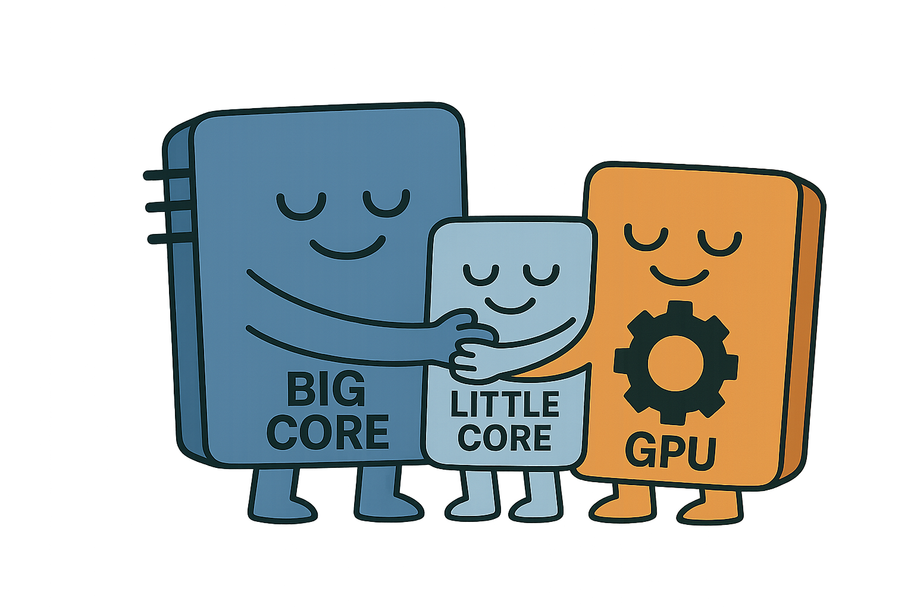

# BetterTogether

<div align="center">



**Profile-Guided Software Pipelining for Heterogeneous Edge SoCs**

[](https://opensource.org/licenses/MIT)
[](https://www.python.org/downloads/)
[](https://en.cppreference.com/w/cpp/17)

### Supported Backends

<p align="center">
  
  
  
</p>

**Keywords**: Edge Computing • Heterogeneous Computing • GPU Computing • Pipeline Parallelism • Performance Modeling • Scheduling Algorithms

</div>

---

## Table of Contents

- [Overview](#overview)
- [Evaluated Applications](#evaluated-applications)
- [Requirements](#requirements)
- [Quick Start](#quick-start)
- [Configuration Files](#configuration-files)
- [Advanced Usage](#advanced-usage)
- [Publications & Citation](#publications--citation)

---

## Overview

**BetterTogether** is a flexible scheduling framework that enables fine-grained software pipelining on heterogeneous edge SoCs. While large-scale data processing typically occurs in the cloud, modern mobile and edge devices are increasingly capable—offering benefits like lower latency, reduced energy consumption, and offline availability. However, efficiently utilizing edge SoCs is challenging: they integrate diverse processing units (PUs) such as big.LITTLE CPU architectures, GPUs, and AI accelerators, each with distinct performance characteristics. Furthermore, execution on one PU can interfere with others, complicating performance modeling.

BetterTogether addresses these challenges through **profile-guided performance modeling** that captures intra-application interference, enabling accurate schedule prediction across diverse edge devices. Applications are provided as a sequence of stages (each with CPU and GPU implementations), which are then pipelined across the SoC's processing units.

### Key Highlights

- 🎯 **Accurate Performance Modeling**: Novel profiling technique that accounts for intra-application interference on integrated SoCs
- ⚡ **Pipeline Parallelism**: Maps application stages to the most efficient processing units (CPU big/medium/little cores, GPU, TPU)
- 🧠 **SMT-Based Optimization**: Uses constraint solving (Z3) to generate optimal static pipeline schedules
- 🚀 **Proven Performance**: Achieves **2.14× geomean speedup** (up to **7.59×**) over homogeneous GPU baselines
- 📱 **Cross-Vendor Portability**: Evaluated on Google Pixel 7a (Arm Mali), OnePlus 11 (Qualcomm Adreno), and NVIDIA Jetson Nano
- 🔧 **Multi-Backend Support**: OpenMP (CPU), CUDA (NVIDIA), and Vulkan (cross-platform GPU)
- 🤖 **Extensible**: Demonstrated integration with Google EdgeTPU for AI acceleration

### Motivation

**Why Edge Computing?**
- ⚡ **Lower Latency**: Process data locally without cloud round-trip
- 🔋 **Energy Efficiency**: Reduced data transmission and optimized on-device compute
- 🔒 **Privacy**: Sensitive data stays on device
- 📶 **Offline Operation**: Works without internet connectivity

**The Challenge**:
Modern edge SoCs integrate diverse processing units (big.LITTLE CPUs, GPUs, AI accelerators), but efficiently utilizing them is difficult:
1. **Performance heterogeneity**: Different stages run best on different PUs (see example below)
2. **Interference effects**: Execution on one PU affects others on integrated SoCs
3. **Device diversity**: Optimal schedules differ across devices (ARM, Qualcomm, NVIDIA)

**Example - 3D Octree Construction on Google Pixel 7a**:
- **Sorting** runs fastest on big/medium CPU cores (~3ms)
- **Radix tree building** runs fastest on GPU (~2ms)
- **Octree construction** performs similarly on big cores and GPU (~4ms)

Simply running everything on GPU or CPU leaves significant performance on the table. BetterTogether's pipeline approach achieves **3.5× speedup** over GPU-only for this workload by intelligently mapping stages to optimal PUs.

---

### Project Statistics

```
===============================================================================
 Language            Files        Lines         Code     Comments       Blanks
===============================================================================
 C Header               22         6390         6390            0            0
 C++                    68        14853         9219         2525         3109
 C++ Header             61         8858         5967         1387         1504
 Fish                    1            3            3            0            0
 GLSL                   22         1775         1212          251          312
 JSON                   54       113267       113267            0            0
 Lua                    23         1712         1087          337          288
 Makefile                1           38           20            9            9
 Python                 33         5641         4020          773          848
 Shell                   2           96           65           22            9
 SVG                    10        24296        24019          277            0
 TOML                    1           12           12            0            0
-------------------------------------------------------------------------------
 Markdown                5          182            0          131           51
 |- BASH                 3            4            4            0            0
 |- Python               1           18           10            4            4
 (Total)                            204           14          135           55
===============================================================================
 Total                 303       177123       165281         5712         6130
===============================================================================
```

---

## Evaluated Applications

BetterTogether has been evaluated on three computer vision workloads with varying computational characteristics:

| Application | Description | Stages | Characteristics |
|------------|-------------|--------|-----------------|
| **CIFAR-Dense** | Dense AlexNet CNN inference on CIFAR-10 | 6 conv layers + 1 linear | Memory-intensive, high arithmetic intensity |
| **CIFAR-Sparse** | Pruned AlexNet with 90% sparsity | 6 conv layers + 1 linear | Irregular memory access, lower arithmetic intensity |
| **Tree** | 3D octree construction pipeline | 7 stages (sorting, radix tree, octree) | Diverse computational patterns, used in robotics/vision |

### Workload Properties

These applications are well-suited for pipeline parallelism because they:

1. **Decompose into stages**: Each application consists of distinct computational phases
2. **Process streaming input**: Operate on independent inputs (e.g., image frames) that arrive continuously
3. **Exhibit heterogeneity**: Different stages have different optimal PUs (as shown in the paper's Figure 1)

### Backends

Each application stage has multiple implementations:
- **OpenMP (CPU)**: Executes on big/medium/little CPU cores with thread affinity
- **CUDA**: For NVIDIA GPUs (Jetson Nano)
- **Vulkan Compute**: Cross-platform GPU compute (Arm Mali, Qualcomm Adreno)

Each application is divided into stages that can be independently scheduled across different processors, enabling BetterTogether to find the optimal mapping for each workload-platform combination.

---

## Requirements

### Core Dependencies

- **[xmake](https://xmake.io/)** - Modern C++ build system
- **[uv](https://astral.sh/uv)** - Fast Python package manager
- **[just](https://github.com/casey/just)** - Command runner (Rust-based)
- **Python 3.13+** - For scheduling and analysis scripts

### Optional Dependencies

- **CUDA Toolkit** - For NVIDIA GPU support
- **Vulkan SDK** - For cross-platform GPU compute
- **Android NDK** - For Android device support
- **ADB** - For Android device deployment

### Installation

```bash
# Install uv (Python package manager)
curl -LsSf https://astral.sh/uv/install.sh | sh

# Install just (command runner)
cargo install just

# Install xmake (build system)
# Visit: https://xmake.io/#/guide/installation
```

---

## Quick Start

### 1. Build the Project

For x86_64 PC with CUDA:
```bash
just set-default
xmake build
```

For NVIDIA Jetson:
```bash
just set-jetson
xmake build
```

For Android (ARM64):
```bash
just set-android
xmake build
```

### 2. Profile Workloads

Collect profiling data for a specific device, application, and backend:

```bash
# Syntax: just collect <device> <app> <backend>
just collect 3A021JEHN02756 cifar-sparse vk
just collect 3A021JEHN02756 cifar-dense vk
just collect 3A021JEHN02756 tree vk
```

Or collect all at once:
```bash
just collect-all-android
```

Profiling data will be stored in `data/bm_logs/<device>/`.

### 3. Generate Optimal Schedules

Use the SMT optimizer to generate execution schedules:

```bash
# Syntax: just gen-schedule <device> <app> <backend> <table_type> <minimize_mode>
just gen-schedule 3A021JEHN02756 cifar-sparse vk btpm gapness
```

Or generate all schedules:
```bash
just gen-schedules-all
```

Schedules will be saved in `data/schedules/<device>/`.

### 4. Execute Schedules

Run the optimized schedules and measure performance:

```bash
# Syntax: just run-schedule <device> <app> <backend> <table_type> <minimize_mode>
just run-schedule 3A021JEHN02756 cifar-sparse vk btpm gapness
```

Execution logs will be stored in `data/exe_logs_<table_type>_<minimize_mode>/<device>/`.

---

## Configuration Files

### Device Configuration

Devices are defined in `builtin-apps/conf.cpp` using their Android device IDs:

```cpp
// Google Pixel 7a (Device ID: 3A021JEHN02756)
Device("3A021JEHN02756", {
  {0, kLittleCore, true},  {1, kLittleCore, true},  // 4× Cortex-A55
  {2, kLittleCore, true},  {3, kLittleCore, true},
  {4, kMediumCore, true},  {5, kMediumCore, true},  // 2× Cortex-A78
  {6, kBigCore, true},     {7, kBigCore, true},     // 2× Cortex-X1
});

// OnePlus 11 (Device ID: 9b034f1b)
Device("9b034f1b", {
  {0, kLittleCore, true},  {1, kLittleCore, true},  // 4× Cortex-A510
  {2, kLittleCore, true},  {3, kLittleCore, true},
  {4, kBigCore, true},     {5, kBigCore, true},     // 3× Cortex-A715
  {6, kBigCore, true},
  {7, kSuperCore, true},                            // 1× Cortex-X3
});

// Samsung Galaxy S23 (Device ID: R5CY21Y3VEV)
Device("R5CY21Y3VEV", {
  {0, kLittleCore, true},  {1, kLittleCore, true},  // 4× Cortex-A55
  {2, kLittleCore, true},  {3, kLittleCore, true},
  {4, kBigCore, true},     {5, kBigCore, true},     // 4× Cortex-A78
  {6, kBigCore, true},     {7, kBigCore, true},
  {8, kSuperCore, true},   {9, kSuperCore, true},   // 2× Cortex-X3
});

// NVIDIA Jetson Nano
Device("jetson", {
  {0, kBigCore, true},     {1, kBigCore, true},     // 4× Cortex-A57
  {2, kBigCore, true},     {3, kBigCore, true},     // (homogeneous)
});
```

**Note**: Find your device ID using `adb devices` command.

### Schedule Format

Schedules are stored as JSON files with the following structure:

```json
{
  "uid": "schedule_unique_id",
  "chunks": [
    {
      "exec_model": "Vulkan",
      "start_stage": 0,
      "end_stage": 2
    },
    {
      "exec_model": "OMP",
      "cpu_proc_type": "Big",
      "start_stage": 3,
      "end_stage": 5
    }
  ]
}
```

---

## Project Structure

```
better-together/
├── builtin-apps/          # Core applications and pipeline framework
│   ├── cifar-dense/       # Dense CNN inference
│   ├── cifar-sparse/      # Sparse CNN inference
│   ├── tree/              # Tree-based algorithms
│   ├── pipeline/          # Scheduling and execution framework
│   └── common/            # Shared utilities (CUDA, Vulkan helpers)
├── scripts/               # Python utilities
│   ├── collect/           # Profiling and scheduling scripts
│   │   ├── 00_bm.py       # Benchmark runner
│   │   ├── 02_gen_schedule_merged.py  # Schedule generator
│   │   ├── 03_run_schedule.py         # Schedule executor
│   │   └── smt/           # SMT solver implementation
│   ├── paper_figures/     # Visualization and result analysis
│   └── view/              # Schedule visualization tools
├── data/                  # Profiling data and schedules
│   ├── bm_logs/           # Profiling tables (CSV)
│   ├── schedules/         # Generated schedules (JSON)
│   └── exe_logs_*/        # Execution measurements
├── resources/             # Model weights and test data
│   ├── cifar/             # CIFAR-10 model parameters
│   └── cifar_batches_*/   # Input batches
├── pipe/                  # Pipeline benchmarking utilities
└── utility/               # System utilities and tests
```

---

## Advanced Usage

### Custom Devices

To add a new device, edit `builtin-apps/conf.cpp` and define core topology:

```cpp
devices_.emplace(
    "my_device_id",
    Device("my_device_id", {
        {0, ProcessorType::kLittleCore, true},
        {1, ProcessorType::kLittleCore, true},
        {2, ProcessorType::kBigCore, true},
        {3, ProcessorType::kBigCore, true},
    })
);
```

### Optimization Modes

BetterTogether supports multiple optimization strategies:

| Mode | Description |
|------|-------------|
| `btpm + gapness` | Better-Together Profiling Model, minimize scheduling gaps |
| `btpm + tmax` | Better-Together Profiling Model, minimize maximum chunk time |
| `isolated + gapness` | Isolated execution model, minimize gaps |
| `isolated + tmax` | Isolated execution model, minimize max time |

### Visualization

Visualize schedules using the provided tools:

```bash
uv run scripts/view/view_schedule.py data/schedules/<device>/<app>/<backend>/schedules_btpm_gapness.json
```

Generate performance comparison plots:

```bash
just compare-schedules <device> <app> <backend> <num_schedules>
```

---

## Publications & Citation

```bibtex
Just presented at IISWC 2025, the citation is coming soon
```

---

## License

This project is licensed under the **MIT License** - see the LICENSE file for details.

---

<div align="center">

**[Documentation](#) • [Issues](https://github.com/ucsc-redwood/better-together/issues) • [Paper (Coming Soon)](#)**

</div>
